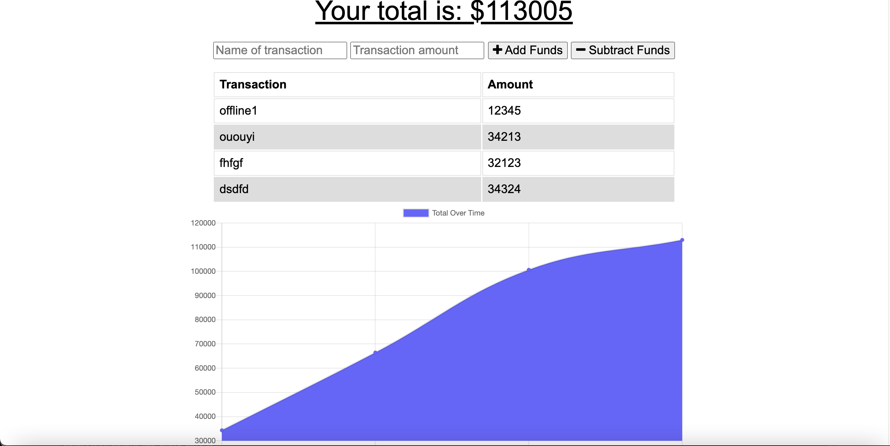
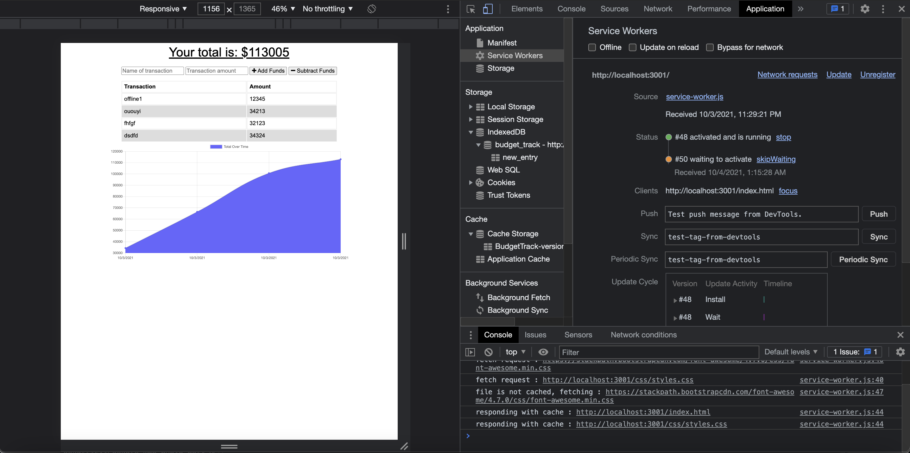
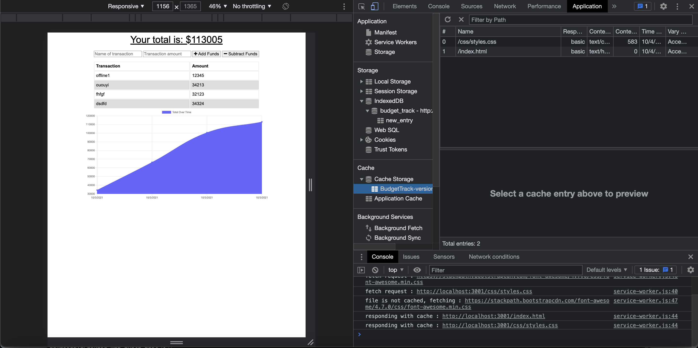
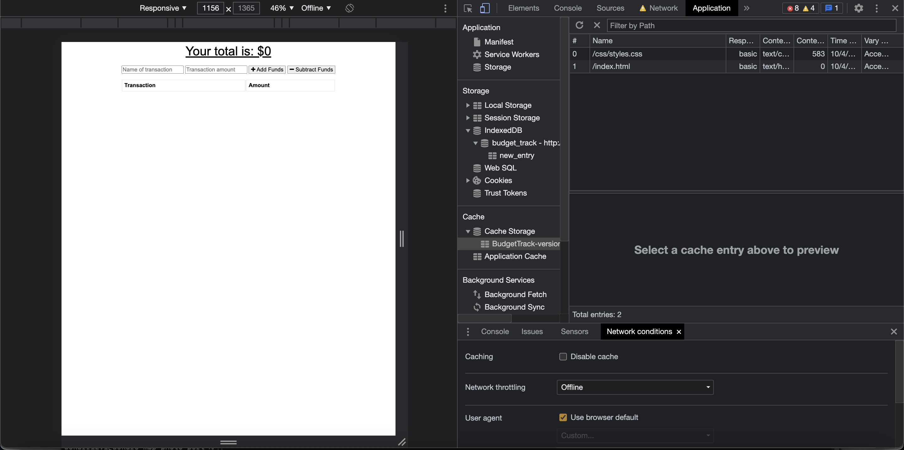
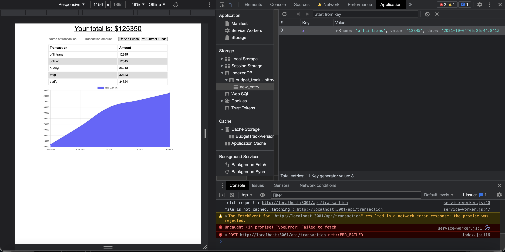

# Budget Track

  

  ## Description
  The challenge for this week involves modifying existing code for a budget tracker app to give it a progressive web app
  capability. This involves using IndexedDB to add offline functionality for submitting budget entries, adding a service worker
  to allow for caching to allow parts of the website to function while offline, and adding a manifest.json file to allow the
  website to be installed as a web app. 

  ## Table of Contents

* [Installation](#installation)
* [Usage](#usage)
* [License](#license)
* [Heroku Deployment](#heroku)
* [Questions](#questions)

## Installation
1: Clone the repository from Github 2:  Run NPM Install to install the modules 3:  Run "npm start" or "nodemon server.js" to start the server 4:  Access the website at http://localhost:3001/index.html or https://safe-forest-82047.herokuapp.com/index.html 

## Usage

## License
https://opensource.org/licenses/MPL-2.0  
Licensed under Mozilla Public License 2.0

## Heroku
https://safe-forest-82047.herokuapp.com/index.html

## Questions
https://github.com/askarrizvi  
